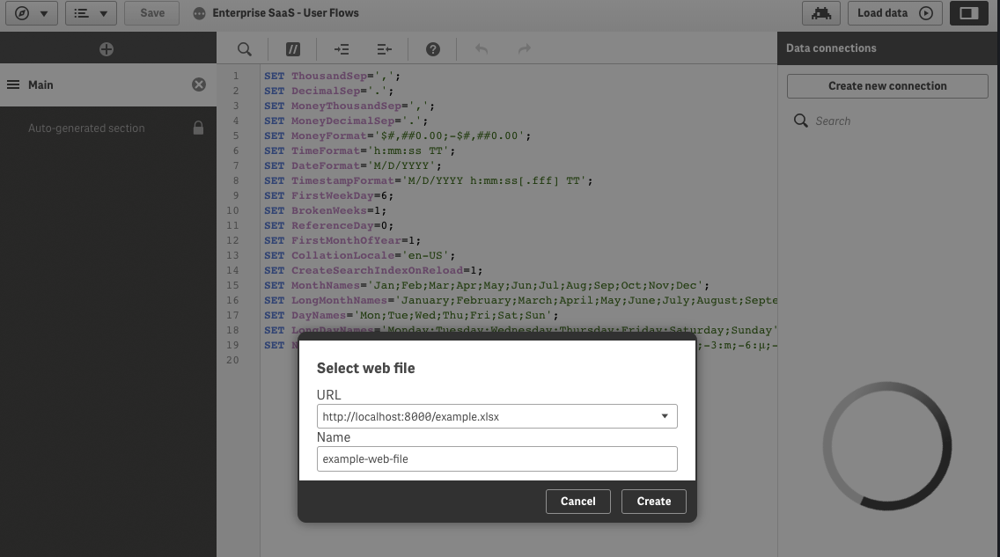

# Create a simple web data file connector for Qlik Sense
This example shows how to serve a static file in a docker container.  This is a simple way to test/use Qlik's web file connector.  Just add the file you want to test to the [web](./web) folder and build and run the docker container.  Then you can create a web file connection in Qlik Sense.



#### build/run instructions
```
docker build -t qlik-web-file-connector .
docker run -p -d 8000:90 qlik-web-file-connector
```

#### try it out
> browse to localhost:8000 result (should see)
## Static html file

> browse to localhost:8000/example.xlsx and the file should be downloaded

#### add more files
add files to the [web](./web) folder and rebuild the container.  Update the [mime.types](./mime.types) file to add more mime types.
