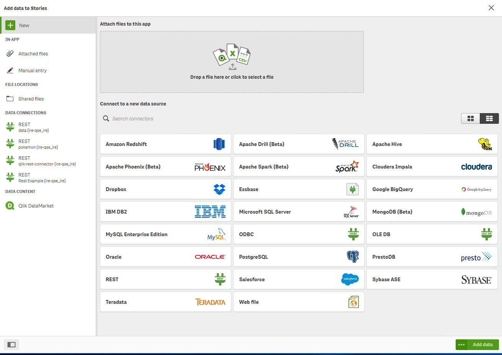
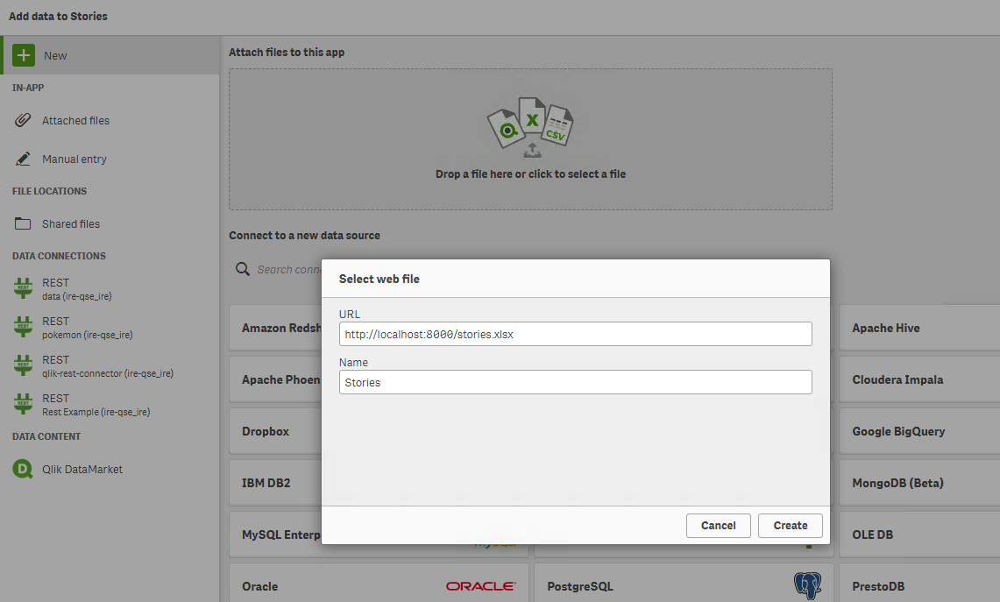
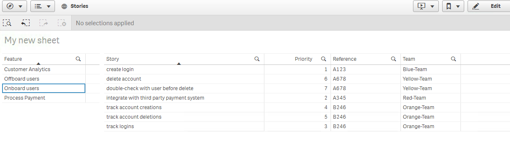

# Create a simple web data file connector for Qlik Sense
This example shows how to serve a static file in a docker container for use as a web file data connector for Qlik Sense.   It walks through an example of starting the web file datasource and creating an app in Qlik Sense Enterprise.  It can be extended to use any file by adding the file to the [web](./web) folder and re-build and run the docker container.  

#### build/run instructions
```
docker build -t qlik-web-file-datasource .
docker run -p 8000:90 -d qlik-web-file-datasource
```

#### try it out
> browse to localhost:8000 result (should see)
### Static html file

> browse to localhost:8000/stories.xlsx and the file should be downloaded

#### create an app using the datasource

Select the "Web file" data source type


Select the web file


Create an app



#### add more files
add files to the [web](./web) folder and rebuild the container.  Update the [mime.types](./mime.types) file to add more mime types.
